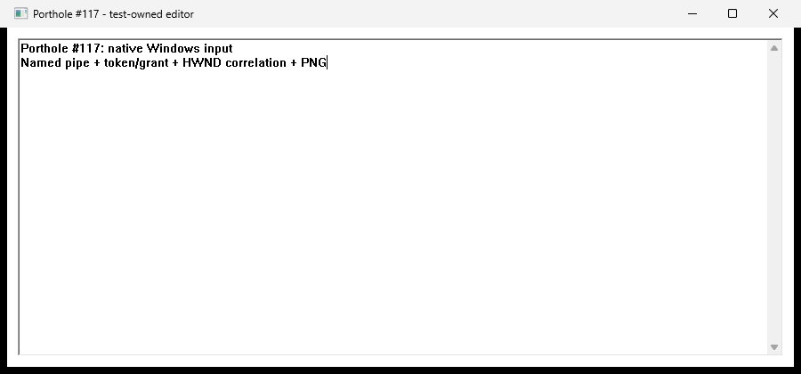

# Windows #117 validation on gouda

Native local desktop acceptance passed on 2026-09-07 at 20:55 UTC. The committed
PNG visibly shows both lines entered through porthole's named-pipe API and CLI.
The initial full-suite run had four inherited Windows failures. These were
fixed during PR integration on 2026-09-08; all four required gates now pass
on Windows and macOS. The original baseline results are retained below.

## Revisions and environment

- Implementation tested: `852e55c8c953e5266117cba5ca295fb41d9386bd` on
  `windows-desktop-adapter`, with a clean source tree at the final live run.
- Base: `28a851185291cc53ea49a4923c5951bc22af57cd` (merged #119).
- Jackstay: public pinned revision `1d0770e943d01fc4a59c26c17162377f7e817a82`.
  The lockfile change only adds the new adapter and its dependency edges.
- Host: gouda; Windows build **26200.9168**, display version **25H2**;
  x86_64-pc-windows-msvc. The registry's legacy ProductName reports Windows 10
  Home; the build/display-version values are recorded without relying on it.
- Rust `1.96.1 (31fca3adb 2026-06-26)`; Cargo `1.96.1 (356927216 2026-06-26)`;
  formatter `nightly-2026-03-12`.
- Runtime correction applied: Windows-native cleat hosts the agent in interactive
  GUI **Session 1**, managed over SSH. PowerShell and explorer were explicitly
  probed in Session 1; SSH services were in Session 0. The smoke also checks the
  spawned daemon's SessionId against its caller. No login/session creation or
  startup automation was used.
- Workspace-write sandboxing and on-request approvals were retained. Dependency
  cache writes, the live GUI smoke, Git writes/push, and the requested progress
  note outside the workspace use scoped approvals. No unrelated checkout was edited.

## Live acceptance

```powershell
cargo build --workspace --locked
cargo build -p porthole-adapter-windows --example desktop_fixture --locked
Get-Process -Id $PID | Select-Object Id, SessionId
Get-Process explorer,sshd,cleat | Select-Object ProcessName, Id, SessionId
powershell -NoProfile -File scripts\manual-windows-smoke.ps1
```

The script returned `PASS`. It used the actual Windows adapter behind
`\\.\pipe\porthole-rober`; no in-memory desktop substitute was used. The app
was the repository's real Win32 editor fixture, with a native EDIT control and
normal message loop. This establishes the supported direct-process/GDI slice,
not arbitrary brokered apps or GPU capture.

The [command excerpt](evidence/windows-117/commands.txt) records the exercised
CLI calls and selected response fields. Complete local output remains under
`target/windows-117-evidence/commands.txt` and `daemon.stdout.log`.

1. `/info` reported `windows`; launch without a token returned
   `agent_identity_required` and launch without a grant returned
   `agent_permission_needed`.
2. A temporary identity/token was provisioned with `porthole agents create`.
   The script approved its pending requests with the existing local-trust
   operator commands. Token values were captured into process memory/environment,
   never printed, saved as evidence, or committed.
3. Launch returned a fresh SurfaceId with `strong` / `pid_tree` correlation.
   Focus initially required the separate surface `drive` grant. After approval,
   focus, Unicode text, Enter, Ctrl+A and End worked through the CLI.
4. Screenshot required a separate `observe` grant. After approval, porthole saved
   the PNG below. Visual inspection confirmed both lines of input and the real
   editor chrome. The screenshot is 900 × 420 pixels at scale 1.
5. Stable wait returned `adapter_unsupported`; a fabricated SurfaceId returned
   `surface_not_found`; a nonexistent executable and the fixture exiting without
   creating a window returned `launch_correlation_failed`.
6. Close required the surface `manage` grant, then closed only the verified editor
   window. Subsequent focus returned `surface_dead`.
7. A second porthole-launched editor exited through native Alt+F4. Subsequent focus
   returned `surface_dead` without a preceding daemon close, proving native
   disappearance detection rather than only a cached handle-store state.
8. The temporary identity was revoked and the smoke's daemon stopped. No
   `desktop_fixture` or `portholed` process remained. No existing user window was
   closed. An early smoke-script grant-expectation error left one test editor;
   its exact PID/path/session were verified and it was closed with approval.



PNG SHA256:
`BE63E1900967E913BB6217C51E64E6D1651EC0AFF197593916E5228BF5713983`.

## Required gates and baseline comparison

| Command | Windows result |
| --- | --- |
| `cargo build --workspace --locked` | Pass |
| `cargo test --workspace --locked` | Fails at inherited `status_cli` Unix-path assertion |
| `cargo clippy --workspace --all-targets --locked -- -D warnings` | Pass |
| `cargo +nightly-2026-03-12 fmt --check` | Pass |
| `cargo test --workspace --locked --no-fail-fast` | 322 passed, 4 failed across 3 targets |
| `cargo build -p porthole-adapter-windows --example desktop_fixture --locked` | Pass |

All six new adapter tests pass: shared key vocabulary, nonexistent executable,
stable window identity/PID-cookie mismatch/destruction, daemon-lifetime identity
and property cleanup, absent/foreign refs, and unsupported pixel wait through
the shared pipeline. The added core Windows-ref roundtrip test passes. The
Windows CI test list now includes the adapter and builds the editor fixture.

The four failures in the full run are:

- `porthole::status_reports_down_with_socket_path`: expects a Unix socket below
  `PORTHOLE_RUNTIME_DIR`, while Windows correctly reports its named pipe.
- `portholed::routes::agent_guard::tests::agent_guard_record_route_requires_observe_and_record_grant`:
  expects 200 after granting record, but the inherited Windows continuous-capture
  stub returns 400. The other 67 daemon library tests pass.
- `xtask::swift_build_uses_package_path_and_scratch_path` and
  `xtask::swift_build_release_uses_release_configuration`: expect forward slashes
  where Windows produces backslashes for the macOS helper scratch path.

Each was reproduced by testing an untouched archive of the base inside this
workspace, without modifying the separate `C:\dev\porthole` checkout:

```powershell
git archive --format=tar --output=target/windows-117-base.tar 28a851185291cc53ea49a4923c5951bc22af57cd
New-Item -ItemType Directory -Force target/windows-117-base
tar -xf target/windows-117-base.tar -C target/windows-117-base
cargo test --manifest-path target/windows-117-base/Cargo.toml -p porthole --test status_cli --locked --target-dir target/windows-117-baseline-build
cargo test --manifest-path target/windows-117-base/Cargo.toml -p portholed -p xtask --lib --test macos_bundle --locked --target-dir target/windows-117-baseline-build --no-fail-fast
```

Logs: `target/windows-workspace-test.log`, `target/windows-all-tests.log`,
`target/windows-117-baseline-test.log`, `target/windows-117-baseline-other.log`.
Broader Windows test portability remains #111. macOS/Linux native regression
checks require those platforms and are left to the coordinator; this report
does not claim those gates or all four AGENTS.md gates are clean.

## Limits

See [the Windows guide](windows-desktop.md) for the supported API and explicit
limitations: direct-process window correlation, foreground/UIPI restrictions,
bounded native PrintWindow capture, and unsupported pointer/placement/content-rect,
pixel waits and continuous capture. #118 startup and cleat-launch orchestration
were not implemented. The branch is for supervising-session review; no PR,
issue comment or merge was created by this task.

## PR integration follow-up — 2026-09-08

After merging main (`c263e18`), the coordinator corrected the four inherited
failures. The status CLI test uses a unique child-process `USERNAME` to select
an isolated Windows named pipe, while retaining temporary-directory socket
isolation on Unix. Swift scratch-path expectations use native filesystem
separators. The authorization test still checks denial before approval, then
expects successful capture on Unix and `adapter_unsupported` on Windows.
The Windows disabled capture-transport error now maps to that code instead of
misreporting a valid request as `invalid_argument`.

On gouda, all four required commands passed: workspace build, full workspace
tests, strict Clippy, and pinned formatting. These checks ran over SSH and do
not replace the interactive Session 1 desktop acceptance above. All four gates
also passed on macOS. Windows CI now runs the full workspace suite rather than
a selected package list; Linux CI passed before this follow-up and will rerun.
