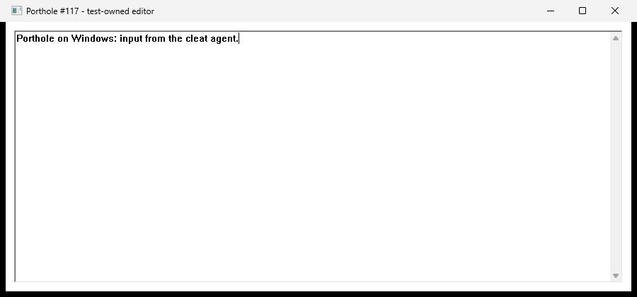
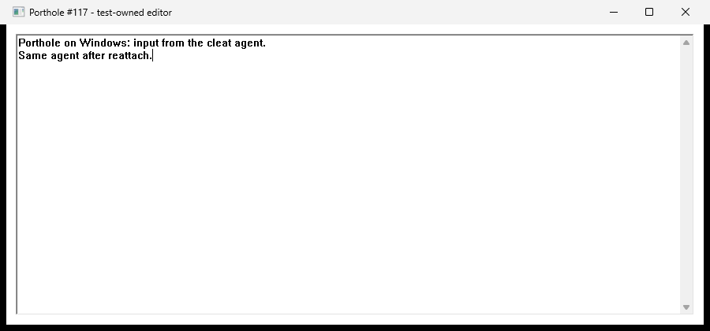

# Windows GUI-session workflow on Gouda

The supervised Porthole → terminal → cleat → Codex → editor workflow passed on
2026-09-11. Remote detach/reattach preserved the same agent, and both screenshots
visibly show the requested input. All four required build/test/lint/format gates
passed on Windows and macOS. Actual at-logon triggering is pending a coordinated
sign-out/sign-in; this report does not claim that check has passed.

## Setup and prerequisite fix

Gouda ran Windows 25H2, build 26200.9445, with `rober` logged into Console Session
1. The initial no-login state was reported as blocked; Robert opened the desktop
before work continued. No automatic login or permission-policy change was used.

The new [startup script](../scripts/windows-workflow/startup.ps1) registers a
per-user Task Scheduler task with an Interactive principal, Limited run level,
and an at-logon trigger. Registration, immediate start, repeated installation of
the same running configuration, removal, and reinstallation were exercised.
`portholed` PID 7044 ran in Session 1 and reported `interactive_desktop: granted`.
The task remains installed for the logon check. It does not run as SYSTEM or
create a Session 0 desktop agent.

The first console attempts exposed a real launch-correlation limitation. A
native probe on `WinSta0\Default` found a visible, unowned `ConsoleWindowClass`
window whose reported PID belonged to the launched console host's child
`cmd.exe`. The original `conhost.exe` had only hidden pseudoconsole/support
windows. Porthole's original-PID-only filter could not find the visible surface.
The hidden pseudoconsole was not substituted as a valid surface.

Commit `268fe1a` adds verified descendant-process correlation. It retains process
handles, checks creation/exit times and snapshot ordering, preserves observed
ancestry when an intermediate exits, and rejects multiple matching windows.
Window cookies and desktop checks remain in force. Native tests cover hidden
child windows, exited intermediates, reversed snapshot ordering, unrelated
processes, ambiguous candidates, and invalid creation-time relationships.

An experimental `CREATE_NEW_CONSOLE` change did not fix the issue and was removed.
The final installed daemon is built without it. A launcher quoting defect was
also corrected before the successful run. Failed runs were retained as evidence;
their owned wrappers were signalled to exit, agents ended, and identities revoked.

## Successful run

Run directory: `C:\dev\porthole-118-run5`. The source build contains the native
changes in `268fe1a` on base `7927f9e`. The recipe lives in
[scripts/windows-workflow](../scripts/windows-workflow/README.md).

The recipe explicitly selects classic `conhost.exe -ForceNoHandoff`, then runs
a command wrapper that starts cleat and waits for a run-local stop marker. It
does not alter the user's default terminal. Windows Terminal's general brokered
launch behavior remains outside this proof.

Porthole returned fresh terminal surface `surf_bb7872d590274b48a449154bd379bb87`
with `strong` / `pid_tree` correlation. The run uses cleat server `workflow`,
session `agent`, and explicit runtime `C:\dev\porthole-118-run5\runtime`.
The directory was restricted to the current user's SID before credentials were
written. The token and launch grant were provisioned before starting Codex.

The GUI-session chain was cleat daemon PID 5020 → session leader `cmd.exe` PID
1660 → PowerShell 996 → cmd 10304 → node 4596 → Codex 1560. All were in Session 1.
SSH attachment clients are separate processes; they do not establish the daemon's
GUI context by themselves. Codex was version 0.153.4, retaining workspace-write
sandboxing and on-request approvals. Calls to the user-scoped Porthole pipe
needed scoped execution outside Codex's separate sandbox account. That did not
change Porthole's token or action checks.

The agent launched the real Win32 `desktop_fixture.exe`, receiving fresh surface
`surf_6b0b8f3fd2cc4116bb58e4e304bc57b8` with strong PID-tree correlation. Its drive,
observe, and manage requests were approved by the coordinator using the existing
local-trust operator path, scoped to this run's identity. The agent never
created or approved its own grants. This proves supervised operation, not
unattended pre-authorization for future surfaces.

The first PNG shows the requested input:



The remote client attached via SSH to the explicit cleat endpoint with
`attach --no-create`. The [before](evidence/windows-118/before-detach.json),
[detached](evidence/windows-118/after-detach.json), and
[reattached](evidence/windows-118/after-reattach.json) records preserve leader PID
1660 and show controller → no attachment → controller. Cleat daemon 5020 and
Codex 1560 retained their process identities/start times across reconnection.
The same agent then added a second line and saved:



Both images were inspected by the coordinator. Porthole then successfully closed
the recorded editor. Recipe cleanup ended the agent, signalled its own terminal
wrapper, waited for the recorded terminal surface to disappear, revoked the
identity, and removed its credential file. The earlier diagnostic agent and
failed-run wrappers were also cleaned up. No test editor or either test Codex
process remained. Recordings and evidence directories were retained; unrelated
sessions were not closed.

## Validation and artifacts

All commands passed on Windows and macOS:

```
cargo build --workspace --locked
cargo test --workspace --locked
cargo clippy --workspace --all-targets --locked -- -D warnings
cargo +nightly-2026-03-12 fmt --check
```

The test subprocess fixture is marked ignored for direct test enumeration but
is explicitly invoked by its controller tests; those native regression tests
ran in the normal Windows suite. The PowerShell scripts also passed parser checks.
The live desktop evidence is separate from CI.

Windows SHA-256 identities:

| Binary | SHA-256 |
| --- | --- |
| portholed | `47BD42CB484E4B6D0478342506ECFFF8BD9B5BF05F3E750E3F8605BB41399459` |
| porthole CLI | `14EEEE1D5D2F04AEA07EE7C88F5FB2A4C24C65525DCD2F08E3992E517AC56DDD` |
| cleat | `E15140FB00071C80897025C9861894C234B0D47F44DB62168D1D0FD05ACFD144` |
| editor fixture | `19B026B6EE779811A06CBF98DFF2EC50E48C604C513FE84E711E21EDBAB0987C` |

Gouda's run directory retains launch responses, process snapshots, startup-task
metadata, binary hashes, images, and cleat recordings. Diagnostic and native-test
logs are under `C:\dev\porthole-118-run3`; no token values are in this report.

Remaining #118 scope: verify actual at-logon startup with the user, and resolve
or explicitly rescope its future-surface pre-authorization criterion alongside
the corresponding macOS #115 limitation. No continuous capture, new authority
service, brokered-app guesswork, or permission bypass was introduced.
