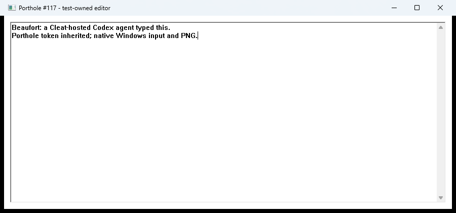

# Beaufort explicit agent launch: partial acceptance

Later evidence: [clean launch and local continuity](2026-09-21-beaufort-clean-launch.md)
now pass with merged foreground handling and two pending Cleat fixes. The
observations below describe the earlier run and its limitations at that time.

Packet 2 of the Windows parity execution plan. The agent is alive in GUI Session
1. Its native typing/screenshot/close proof passed after the human activated the
preserved editor. Clean-launch and lifecycle acceptance remain outstanding.

## Observed

- Porthole launched a fresh visible console with strong process-tree correlation.
- A dedicated Cleat daemon hosts `beaufort-parity/coding-agent`, using functional
  Ghostty VT. Codex 0.155.1 authenticated with the existing ChatGPT login.
- The agent tool process inherited its Porthole token and launched the real
  `desktop_fixture.exe` through Porthole. Tokens were passed via launch environment,
  never command arguments or persisted session environment overrides.
- Windows returned `system_permission_needed` on foreground activation. The
  agent stopped and reported the failure. A second attempt preserved the editor
  for human activation. After the human confirmed activation, the same agent
  resumed that surface, typed both expected lines, captured a PNG and closed it.
- Repeating start returned `REUSED` with the same agent entry PID and identity.
- A corrected Cleat client attached as controller `beaufort-local` to the original
  running agent. The daemon and Codex were not restarted.
- The pre-existing RAD Cleat daemon PID 13804, started at 12:37:50 local time,
  remained untouched in Session 1.

Live run: `C:\dev\windows-parity-plan\vessel-beaufort`. Public identity:
`agent_98533e4e98d3425981bf1ca230d879a3`. Agent entry PID 12884; Codex PID 12296;
Porthole PID 10008; dedicated Cleat daemon PID 11612. Agent continuity marker:
`50e6eeff-46cf-41cf-9470-4284da334439`.

## Resumed desktop proof

Passed at `2026-09-21T14:37:30.8622353Z`, from agent tool process PID 6968 in
Windows Session 1. Visual inspection confirmed both lines in the screenshot:

```text
Beaufort: a Cleat-hosted Codex agent typed this.
Porthole token inherited; native Windows input and PNG.
```



PNG SHA-256: `261F7F4E45FAD52B3E7960B819BDA2D9618EB863A14CB9479773667045F7578A`.
The result is recorded in the live run's `agent-desktop-result.json`.
The pending-surface artifact was removed by successful completion. The original
agent entry, Codex, dedicated Cleat daemon and Porthole process IDs and start
times remained unchanged. Codex reported success and remains available.
This proves recovery after manual foreground activation; it does not prove
unattended foreground activation or RDP/lock recovery.

## Console launch diagnosis

Direct `conhost.exe` launch failed fresh-surface correlation, including probes
with `--` and `-ForceNoHandoff`. A PowerShell wrapper using normal Windows
`Start-Process` console startup passed the same native launch/close probe.
The wrapper remains alive for process-tree correlation.

The sparse Microsoft Terminal reference checkout is pinned at
`7c92ecd037476f957809d0813b14d8bc44bb071a`. Its
[ConsoleArguments.cpp](https://github.com/microsoft/terminal/blob/7c92ecd037476f957809d0813b14d8bc44bb071a/src/host/ConsoleArguments.cpp)
classifies valid standard transport handles as ConPTY mode. Porthole launches
children with null-device streams. This source and the differential probe support
using the normal console-start path; no Porthole adapter change was required.

## Cleat pipe diagnosis

Launch and send-key requests could take effect but report pipe-ended error 109;
interactive attach then exited. Inspection showed the agent still running.
The missing launch output was initially suspected to be a captured-output hang,
but Cleat already redirects daemon standard streams. The transport regression
instead reproduced the actual failure: `read_to_end` received error 109 when
the server closed during an outstanding overlapped read.

Cleat already converted immediate broken-pipe reads to EOF. The correction applies
the same conversion after pending completion. The new native regression failed
before the fix and passed afterward. A separately built client then attached to
the unchanged daemon successfully. The fix is commit `0e1e958` in
[Cleat draft PR #219](https://github.com/flotilla-org/cleat/pull/219).
Microsoft documents completion via
[GetOverlappedResult](https://learn.microsoft.com/en-us/windows/win32/api/ioapiset/nf-ioapiset-getoverlappedresult).

## Builds and limits

Cleat baseline: `d5039f2dcd5ac25080cf6918d5e8b9ebe26f80bc`. Normal setup helper
built pinned Ghostty `c3dbb925e6cbcfceafba5749f81a486dd2275099` with Zig 0.16.0.
Baseline library tests: 231 passed; VT tests: 43 passed, one ignored.
With the pipe correction: workspace tests passed (430 tests, one ignored),
application build passed, pinned nightly formatting passed. Strict Clippy still
fails on existing Windows warnings, including unused Unix-only code, mutable
references and older iterator spelling. It is not a clean CI-parity claim.

Build/test logs are under
`C:\dev\windows-parity-plan\evidence\beaufort-agent-20260921`.
Porthole's exact workspace build, workspace tests, strict all-target Clippy and
pinned-nightly formatting gates passed in a separate `agent-launch-target`
directory. The PowerShell scripts pass parser validation. These checks do not
replace the outstanding live acceptance steps below.
Corrected client binaries are isolated under `cleat-client-bin` so rebuilding
does not overwrite a loaded DLL or running daemon executable.

## Required foreground-switching acceptance

Follow-up: [the foreground activation change and native regression](2026-09-21-windows-foreground-activation.md)
now pass 20 switches after simulated input from a separate process. The original
vessel has not been restarted onto that binary; physical-input and remote/lifecycle
acceptance remain open.

Reliable unattended window switching is an explicit Windows parity requirement.
The successful manual-activation recovery above does not satisfy it. On an
unlocked, usable desktop, the agent must be able to switch between two test-owned
application windows and type into the intended target without a human click for
each switch. Verify the actual foreground window and resulting input, including
after intervening human input and local/SSH terminal reattachment.

Investigate the supported `AllowSetForegroundWindow` handoff and its lifetime
before choosing an implementation. It requires an already eligible caller and
can expire after user input; a one-time launch grant is not sufficient evidence
for a long-running agent. The current adapter's `SetForegroundWindow` call and
bounded foreground check do not establish that handoff.

Keep locked/disconnected desktop behavior distinct: the agent and terminal must
persist, while desktop actions may wait boundedly or fail clearly. Activation
failure must never allow typing into the wrong window. Record the native outcome
and desktop state rather than treating every failure as a user-grantable permission.

Outstanding: unattended foreground switching; a clean full launch with the corrected Cleat client; forced-stop
cleanup; kiwi SSH attach; login startup;
RDP disconnect/lock continuity. Jackstay Direct3D work is outside this packet.
