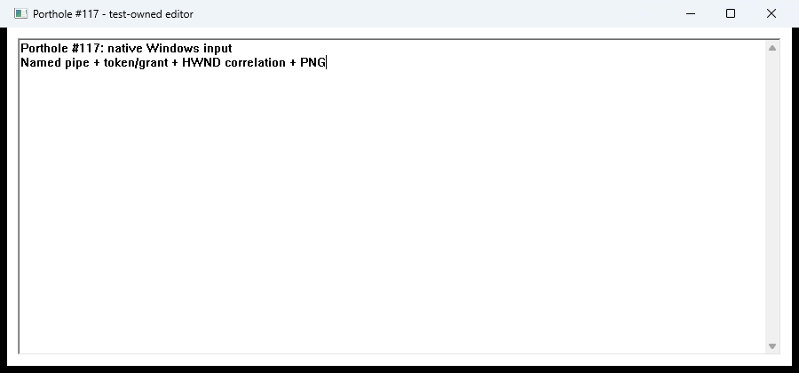

# Beaufort Windows desktop baseline

First execution packet from the [Windows parity plan](https://github.com/flotilla-org/porthole/blob/df2b5e8db1d836a1dd5d05734cfbbae30c978049/docs/windows-parity-execution-plan.md), under [the Windows GUI-session workflow](https://github.com/flotilla-org/porthole/issues/118).

Native desktop acceptance passed on 2026-09-21 in Beaufort's GUI Session 1. The saved PNG visibly shows both input lines delivered through Porthole. All four required repository gates and the native fixture build passed; no application code changes were needed.

## Environment and source

- Host: Beaufort, Windows 25H2, build `26200.8653`.
- Tested Porthole source: `92b00db93020ea4e610d06a61b2bfef3c3e54e7c`, in an isolated worktree at `C:\dev\windows-parity-plan\implementation`. The original checkout remained unchanged.
- Winget installed `Rustlang.Rustup` version `1.29.1`, after verifying the installer hash. It selected stable Rust `1.98.1 (48a229cea 2026-09-01)`, Cargo `1.98.1 (797e8a9bc 2026-08-05)`, host `x86_64-pc-windows-msvc`.
- Formatter: `nightly-2026-03-12`, Rust `1.96.0-nightly (3b1b0ef4d 2026-03-11)`, with rustfmt installed. Stable Clippy was already installed by rustup.
- Existing native toolchain: Visual Studio Build Tools 2022, installation version `17.14.37710.0`; SDK `10.0.26100.0` was previously inventoried. No Visual Studio installation or reconfiguration was needed for the workspace build.
- Caller and Explorer were in Session 1. Existing RAD Cleat was PID `13804`, Session 1, executable `C:\dev\rad-test-tools-kJTJhU\cleat.exe`, local start time `2026-09-21 12:37:50`. No Porthole daemon was running at preflight.
- Local raw evidence directory: `C:\dev\windows-parity-plan\evidence\beaufort-desktop-20260921`.

## Repeatable setup

Install the recorded rustup package through winget:

```powershell
winget show --id Rustlang.Rustup --exact --source winget --accept-source-agreements
winget install --id Rustlang.Rustup --version 1.29.1 --exact --source winget --silent --accept-package-agreements --accept-source-agreements --disable-interactivity
```

Rustup updates the user environment, but existing applications can keep their old PATH. This run prepended the verified `C:\Users\rober\.cargo\bin` path only inside the build shell; RAD was not restarted. A fresh shell should verify actual command resolution. The compiler selected by `stable` can change later; reproduce this run with Rust `1.98.1` if investigating a difference.

```powershell
rustc -Vv
cargo -V
rustup show
rustup component add clippy
rustup toolchain install nightly-2026-03-12 --profile minimal --component rustfmt
```

For an exact compiler replay in a dedicated worktree, install `1.98.1` and set a directory override there before the commands below. This was unnecessary on the recorded run because stable already selected `1.98.1`; avoid changing another project's toolchain selection.

## Build and test results

| Command | Result |
| --- | --- |
| `cargo build --workspace --locked` | Pass |
| `cargo test --workspace --locked` | Pass: 359 passed, 0 failed, 1 ignored across test/doc-test summaries |
| `cargo clippy --workspace --all-targets --locked -- -D warnings` | Pass |
| `cargo +nightly-2026-03-12 fmt --check` | Pass |
| `cargo build -p porthole-adapter-windows --example desktop_fixture --locked` | Pass |

The ignored test is `native::launch_tests::native_launch_fixture`, marked as a subprocess fixture invoked by the native descendant regression. The non-ignored suite and the separate live desktop smoke are different evidence.

[Recorded command exit codes and UTC times](evidence/beaufort-2026-09-21/build-results.json) cover the run from 13:04:07 through 13:06:23 UTC. Full build, test, Clippy, formatter and fixture logs remain in the local raw evidence directory. Only report/evidence files were added after these checks; no source implementation or lockfile changes followed.

## Real desktop acceptance

From the isolated worktree, in the existing unlocked GUI session:

```powershell
powershell -NoProfile -File scripts\manual-windows-smoke.ps1 -EvidenceDir C:\dev\windows-parity-plan\evidence\beaufort-desktop-20260921\smoke
```

The script exited 0 with `PASS`. Its command log began at `2026-09-21T13:06:35.7220067Z` and recorded Session 1. The script also checks that its temporary daemon has the caller's SessionId; it did not record the daemon's PID. The daemon log records the real endpoint `\\.\pipe\porthole-rober`. `/info` reported the Windows adapter loaded and interactive desktop permission granted.

The [command/results evidence](evidence/beaufort-2026-09-21/commands.txt) records:

- Missing token and missing grant failures, followed by grants scoped to the temporary identity.
- A fresh editor window with strong `pid_tree` correlation, then native focus, text, Enter, Ctrl+A and End input. The first fixture PID was `5444`.
- Screenshot denial before the observe grant, then a successful Porthole PNG of the real rendered window.
- Explicit unsupported stable wait, missing-surface failure, nonexistent-executable failure and process-exits-without-window failure.
- Close authorization and successful native close; subsequent focus reports `surface_dead`.
- A second fixture (PID `13092`) exiting through native Alt+F4, followed by `surface_dead` without a prior Porthole close.
- Revocation of the run's temporary identity, returning `revoked: true`.



The 900 x 420 image was visually inspected and contains both lines:

```text
Porthole #117: native Windows input
Named pipe + token/grant + HWND correlation + PNG
```

The fixture retains its historical issue number in its title/text; this image is from the new Beaufort run. PNG SHA256: `33685B70AFCBBD5FF4ED1283896E3A98ADD0A2CD645269F818CAF249A794D6EA`.

After the smoke, no `portholed` or `desktop_fixture` process remained. RAD Cleat still had PID `13804`, the same executable, SessionId and start time as preflight. The original Porthole checkout remained clean. The smoke revoked its temporary identity; it did not delete the shared policy database or unrelated records. Token creation output was held in memory and excluded from the command log; no token value is in this evidence.

## Limits

This packet does not establish automatic login startup, a Porthole-launched coding agent, kiwi SSH attachment, same-agent persistence across RDP disconnect/lock, arbitrary brokered app launch, GPU screenshot compatibility, or native Jackstay transport. Those remain later execution packets. The existing gouda report remains historical evidence on another host, not a substitute for this run.
